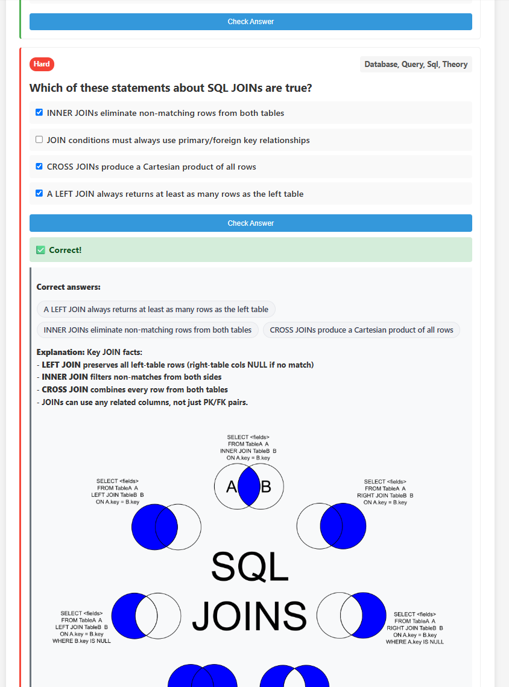

# Online version

[Github Pages](https://s-elephant.github.io/CodeInterviewPrep/)

# About



I created this interactive programming quiz to help developers test and sharpen their coding knowledge. Some friends and old colleagues requested a tool like this.

- **Clean UI**
- **Diverse question types**.
- **Dynamic explanations**.
- **Instant feedback** with explanations.
- **Open source**

*Great for interview warm-ups, quick knowledge checks, or team quizzes but pair it with deeper and more specific resources for a full prep!*

# Fetch error (CORS)

If the fetch command fails locally for Chrome (because CORS and because you don't run it as a local server) then follow these steps:

1. Right-click desktop → New → Shortcut.
2. Paste this into the target: `"C:\Program Files\Google\Chrome\Application\chrome.exe" --allow-file-access-from-files --user-data-dir="C:\Temp\ChromeTempSession" --disable-web-security`
3. Launch the shortcut (don't sign in) and open the index.html file in this Chrome window (you may drag and drop `index.html` into that Chrome window).

Or use the shortcut that I added to the project directory.

# Adding/Modifying questions

```json
{
	"type": "multiple_choice",
	"question": "What color is the sky usually during a normal bright day?",
	"answers": ["Blue", "Red", "Purple", "White"],
	"allowAnswerShuffling": true,
	"correctIndices": [0],
	"explanation": "Because <b>reasons</b>.",
	"tags": ["nonsense", "weather"],
	"difficulty": "medium",
	"importance": "essential"
},
{
	"type": "multi_select",
	"question": "Which of these are capital cities?",
	"answers": ["Amsterdam", "New York", "Paris", "Osaka"],
	"allowAnswerShuffling": true,
	"correctIndices": [0, 2],
	"explanation": "Only Amsterdam and Paris are capital cities because.. history.",
	"tags": ["geography"],
	"difficulty": "hard",
	"importance": "high"
},
{
	"type": "text_input",
	"question": "How much is 1 + 1?",
	"correct_answers": ["2", "two"],
	"explanation": "Because math. I know, it doesn't make sense right? It should obviously have been 42.",
	"tags": ["math"],
	"difficulty": "easy",
	"importance": "very rare"
},
{
	"type": "info",
	"question": "What is the meaning of life?",
	"explanation": "To eat as many cookies as possible.",
	"tags": ["philosophy"],
	"difficulty": "hard",
	"importance": "essential"
},
// Etc.
```

## Notes

- Tags are case-insensitive (treated as lowercase) and support spaces, but lowercase without spaces is preferred (e.g., use `data-structures` instead of `Data Structures`).
- The `question` and `explanation` and `answers` sections in the JSON are compatible with HTML, including images and such.
- `difficulty`, `importance`, `explanation` and `tags` are optional.
- ` allowAnswerShuffling` is optional for `multiple_choice` and  `multi_select` and defaults to `true` if it's not present.

## Possible type values

- `multiple_choice` (user must chose 1 answer)
- `multi_select` (user must select 1 or more answers but must select ALL correct ones)
- `text_input` (user must type an answer)
- `info` (user must click the button to see the answer)

## Possible difficulty values

- `easy`
- `medium`
- `hard`

## Possible importance values

- `essential`
- `important`
- `standard`
- `rare`
- `very rare`